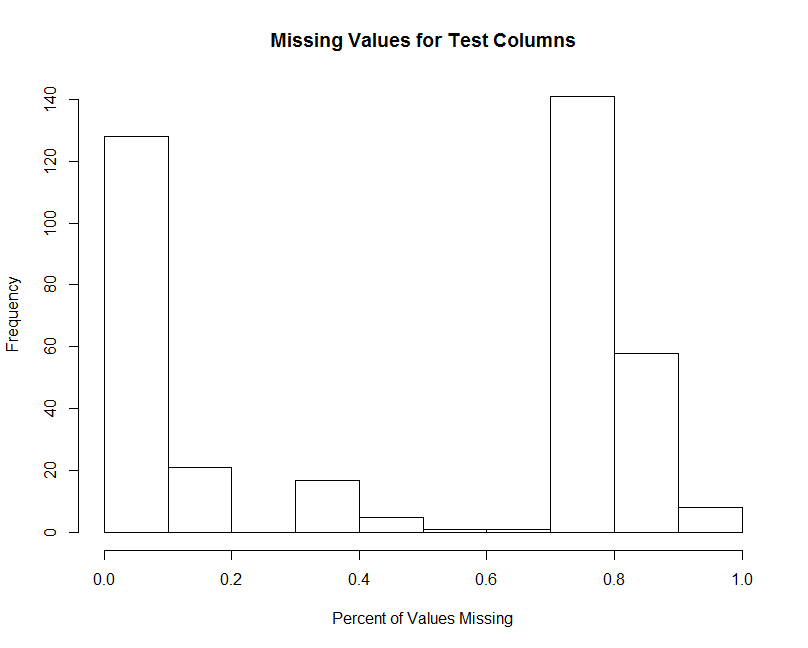
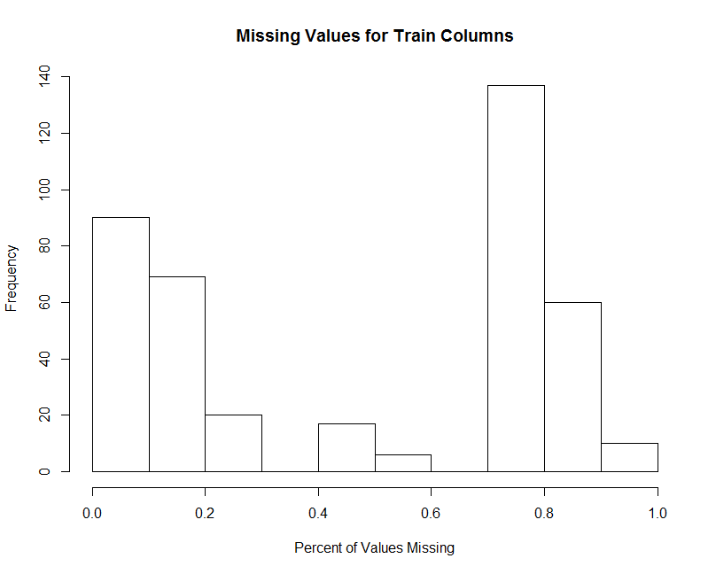
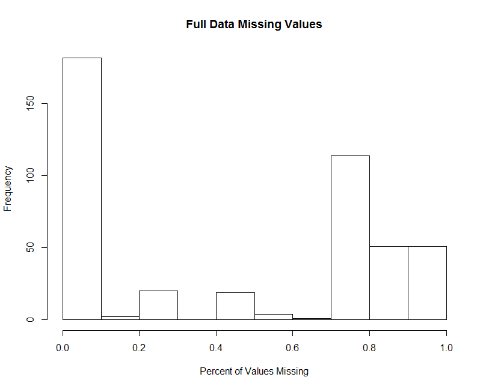
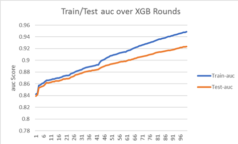

# Machine Learning Fraud Detection
## Leslie Bai, Rebecca Wells, Jeremy Ross, Chris Pickens

### Links

- [Competition Link](https://www.kaggle.com/c/ieee-fraud-detection/notebooks?sortBy=hotness&group=everyone&pageSize=20&competitionId=14242&language=R)
- [Original Notebook](https://www.kaggle.com/psystat/ieee-extensive-eda-lgb-with-r#Modeling)

### General Background

For our second team presentation we selected the IEEE-CIS Fraud Detection competition as our topic. The goal of this competition was to calculate the probability a given card transaction was fraudulent. To do so, we needed to create a model based on Vesta's real-world transactions. Although this competition provided a number of challenges to deal with such as the amount of data in question as well its completeness, we were ultimately able to come to an appropriate solution that improved on the notebooks available through changes in data cleaning as well as the usage of the xgboost method during the modeling phase.

---

### Original Notebook

Looking at the original notebook we decided to critique and build off, there were a lot of aspects we liked and wanted to include in our own solution. Most significantly, we thought the process this notebook used to take care of missing values in the data made a lot of sense given the circumstances of the problem. This might seem like a small point to follow but missing values played a major role in the handling of this data. Many of the columns in this dataset were missing upwards of 80 to 90 percent of their values, so we felt the original was right in dropping many of those columns alltogether. Having said that, we did end up using a lower bar for those columns to be dropped. Additionally we also felt another change that could be made was to change some of the data from numerical values to integer values during the data preparation phase as we felt this would allow us our model to be less computationally intensive than the original code. Finally, although the original model is based around Light GBM, we felt a XGB model would be better. Specifically, we know that XGB models tend to outperform GBM models when dealing with smaller datasets and more training, both of which we felt would be applicable to this problem. With that in mind, we anticipated XGB resulting in a more accurate final model than the original we were basing ours off of, a prediction that did appear to pan out given our score of about 0.96 to the original's 0.93.

--- 

### Code Setup

Before starting our code it makes sense to begin by clearing your environment using`rm(list=ls())`. We then can use `needed` list as an argument for the `installifAbsentAndLoad` function defined below. This allows us to ensure R is running the packages required for the rest of the program.

```
installIfAbsentAndLoad <- function(neededVector) {
  for(thispackage in neededVector) {
    if( ! require(thispackage, character.only = T) )
    { install.packages(thispackage)}
    require(thispackage, character.only = T)
  }
}

needed <- c('tidyverse','xgboost','dplyr','data.table','inspectdf',
            'tictoc','caret')  
installIfAbsentAndLoad(needed)
```
### Load Data and Overview

After loading the data into the following four tables, we can start exploring it.

```
train_identity <- read.table("train_identity.csv", header=T, sep=',') 
test_identity <- read.table("test_identity.csv", header=T, sep=',')
train_transaction <- read.table("train_transaction.csv", header=T, sep=',')
test_transaction <- read.table("test_transaction.csv", header=T, sep=',')
```

One aspect we can investigate is Dimensions, which shows us the number of rows and columns in each table we look at.

```
> (dim(train_identity))  # row, column 
[1] 127777     41
> (dim(test_identity))
[1] 141907     41
> (dim(train_transaction))
[1] 590540    394
> (dim(test_transaction))
[1] 506691    393
```
We can also use `head(train_transaction)` to get an idea of just how many missing variables we'll need to deal with later on in the process. As you can see by the output, it's a significant amount.

```
TransactionID isFraud TransactionDT TransactionAmt ProductCD card1 card2
1       2987000       0         86400           68.5         W 13926    NA
2       2987001       0         86401           29.0         W  2755   404
  card3      card4 card5  card6 addr1 addr2 dist1 dist2 P_emaildomain
1   150   discover   142 credit   315    87    19    NA              
2   150 mastercard   102 credit   325    87    NA    NA     gmail.com
  R_emaildomain C1 C2 C3 C4 C5 C6 C7 C8 C9 C10 C11 C12 C13 C14 D1 D2 D3 D4 D5
1                1  1  0  0  0  1  0  0  1   0   2   0   1   1 14 NA 13 NA NA
2                1  1  0  0  0  1  0  0  0   0   1   0   1   1  0 NA NA  0 NA
  D6 D7 D8 D9 D10 D11 D12 D13 D14 D15   M1   M2   M3 M4    M5   M6 M7 M8 M9
1 NA NA NA NA  13  13  NA  NA  NA   0 TRUE TRUE TRUE M2 FALSE TRUE NA NA NA
2 NA NA NA NA   0  NA  NA  NA  NA   0   NA   NA   NA M0  TRUE TRUE NA NA NA
  V1 V2 V3 V4 V5 V6 V7 V8 V9 V10 V11 V12 V13 V14 V15 V16 V17 V18 V19 V20 V21
1  1  1  1  1  1  1  1  1  1   0   0   1   1   1   0   0   0   0   1   1   0
2 NA NA NA NA NA NA NA NA NA  NA  NA   0   0   1   0   0   0   0   1   1   0
  V22 V23 V24 V25 V26 V27 V28 V29 V30 V31 V32 V33 V34 V35 V36 V37 V38 V39 V40
1   0   1   1   1   1   0   0   0   0   0   0   0   0  NA  NA  NA  NA  NA  NA
2   0   1   1   1   1   0   0   0   0   0   0   0   0   0   0   1   1   0   0
  V41 V42 V43 V44 V45 V46 V47 V48 V49 V50 V51 V52 V53 V54 V55 V56 V57 V58 V59
1  NA  NA  NA  NA  NA  NA  NA  NA  NA  NA  NA  NA   1   1   1   1   0   0   0
2   1   0   0   1   1   1   1   0   0   0   0   0   0   0   1   1   0   0   0
  V60 V61 V62 V63 V64 V65 V66 V67 V68 V69 V70 V71 V72 V73 V74 V75 V76 V77 V78
1   0   1   1   0   0   1   1   1   0   0   0   0   0   0   0   1   1   1   1
2   0   1   1   0   0   1   1   1   0   0   0   0   0   0   0   0   0   1   1
  V79 V80 V81 V82 V83 V84 V85 V86 V87 V88 V89 V90 V91 V92 V93 V94 V95 V96 V97
1   0   0   0   0   0   0   0   1   1   1   0   0   0   0   0   0   0   1   0
2   0   0   0   1   1   0   0   1   1   1   0   0   0   0   0   0   0   0   0
  V98 V99 V100 V101 V102 V103 V104 V105 V106 V107 V108 V109 V110 V111 V112
1   0   0    0    0    1    0    0    0    0    1    1    1    1    1    1
2   0   0    0    0    0    0    0    0    0    1    1    1    1    1    1
  V113 V114 V115 V116 V117 V118 V119 V120 V121 V122 V123 V124 V125 V126 V127
1    1    1    1    1    1    1    1    1    1    1    1    1    1    0  117
2    1    1    1    1    1    1    1    1    1    1    1    1    1    0    0
  V128 V129 V130 V131 V132 V133 V134 V135 V136 V137 V138 V139 V140 V141 V142
1    0    0    0    0    0  117    0    0    0    0   NA   NA   NA   NA   NA
2    0    0    0    0    0    0    0    0    0    0   NA   NA   NA   NA   NA
  V143 V144 V145 V146 V147 V148 V149 V150 V151 V152 V153 V154 V155 V156 V157
1   NA   NA   NA   NA   NA   NA   NA   NA   NA   NA   NA   NA   NA   NA   NA
2   NA   NA   NA   NA   NA   NA   NA   NA   NA   NA   NA   NA   NA   NA   NA
  V158 V159 V160 V161 V162 V163 V164 V165 V166 V167 V168 V169 V170 V171 V172
1   NA   NA   NA   NA   NA   NA   NA   NA   NA   NA   NA   NA   NA   NA   NA
2   NA   NA   NA   NA   NA   NA   NA   NA   NA   NA   NA   NA   NA   NA   NA
  V173 V174 V175 V176 V177 V178 V179 V180 V181 V182 V183 V184 V185 V186 V187
1   NA   NA   NA   NA   NA   NA   NA   NA   NA   NA   NA   NA   NA   NA   NA
2   NA   NA   NA   NA   NA   NA   NA   NA   NA   NA   NA   NA   NA   NA   NA
  V188 V189 V190 V191 V192 V193 V194 V195 V196 V197 V198 V199 V200 V201 V202
1   NA   NA   NA   NA   NA   NA   NA   NA   NA   NA   NA   NA   NA   NA   NA
2   NA   NA   NA   NA   NA   NA   NA   NA   NA   NA   NA   NA   NA   NA   NA
  V203 V204 V205 V206 V207 V208 V209 V210 V211 V212 V213 V214 V215 V216 V217
1   NA   NA   NA   NA   NA   NA   NA   NA   NA   NA   NA   NA   NA   NA   NA
2   NA   NA   NA   NA   NA   NA   NA   NA   NA   NA   NA   NA   NA   NA   NA
  V218 V219 V220 V221 V222 V223 V224 V225 V226 V227 V228 V229 V230 V231 V232
1   NA   NA   NA   NA   NA   NA   NA   NA   NA   NA   NA   NA   NA   NA   NA
2   NA   NA   NA   NA   NA   NA   NA   NA   NA   NA   NA   NA   NA   NA   NA
  V233 V234 V235 V236 V237 V238 V239 V240 V241 V242 V243 V244 V245 V246 V247
1   NA   NA   NA   NA   NA   NA   NA   NA   NA   NA   NA   NA   NA   NA   NA
2   NA   NA   NA   NA   NA   NA   NA   NA   NA   NA   NA   NA   NA   NA   NA
  V248 V249 V250 V251 V252 V253 V254 V255 V256 V257 V258 V259 V260 V261 V262
1   NA   NA   NA   NA   NA   NA   NA   NA   NA   NA   NA   NA   NA   NA   NA
2   NA   NA   NA   NA   NA   NA   NA   NA   NA   NA   NA   NA   NA   NA   NA
  V263 V264 V265 V266 V267 V268 V269 V270 V271 V272 V273 V274 V275 V276 V277
1   NA   NA   NA   NA   NA   NA   NA   NA   NA   NA   NA   NA   NA   NA   NA
2   NA   NA   NA   NA   NA   NA   NA   NA   NA   NA   NA   NA   NA   NA   NA
  V278 V279 V280 V281 V282 V283 V284 V285 V286 V287 V288 V289 V290 V291 V292
1   NA    0    0    0    1    1    0    0    0    0    0    0    1    1    1
2   NA    0    0    0    1    1    0    0    0    0    0    0    1    1    1
  V293 V294 V295 V296 V297 V298 V299 V300 V301 V302 V303 V304 V305 V306 V307
1    0    1    0    0    0    0    0    0    0    0    0    0    1    0  117
2    0    0    0    0    0    0    0    0    0    0    0    0    1    0    0
  V308 V309 V310 V311 V312 V313 V314 V315 V316 V317 V318 V319 V320 V321 V322
1    0    0    0    0    0    0    0    0    0  117    0    0    0    0   NA
2    0    0    0    0    0    0    0    0    0    0    0    0    0    0   NA
  V323 V324 V325 V326 V327 V328 V329 V330 V331 V332 V333 V334 V335 V336 V337
1   NA   NA   NA   NA   NA   NA   NA   NA   NA   NA   NA   NA   NA   NA   NA
2   NA   NA   NA   NA   NA   NA   NA   NA   NA   NA   NA   NA   NA   NA   NA
  V338 V339
1   NA   NA
2   NA   NA
 [ reached 'max' / getOption("max.print") -- omitted 4 rows ]
```

Now that we've had a chance to get a first look at the data, we can use the left join function to combine the train_identity and test_identity tables with the train_transaction and test_transaction tables, respectively. Once this is completed we can get rid of the four initial tables as they no longer serve a function for us.

```
train <- left_join(train_transaction, train_identity)
test <- left_join(test_transaction, test_identity)

rm(train_identity, train_transaction, test_identity, test_transaction)
```

If you want, at this point you can check the dimensions of the new train and test tables to confirm the join was done properly and use the `head()` function to see if the addition of the identity tables made our missing values problem worse. Thankfully, at first glance it appears that this isn't the case. The identity tables contained signficiant amounts of categorical information that was by and large aquired uniformly for all or most transactions. While there are still new missing values that we now need to deal with in addition to our initial transaction table ones, the impact could have been worse.

```
> (dim(train)) 
[1] 590540    434
> (dim(test))
[1] 506691    433
```

```
> head(train)
  TransactionID isFraud TransactionDT TransactionAmt ProductCD card1 card2
1       2987000       0         86400           68.5         W 13926    NA
2       2987001       0         86401           29.0         W  2755   404
  card3      card4 card5  card6 addr1 addr2 dist1 dist2 P_emaildomain
1   150   discover   142 credit   315    87    19    NA              
2   150 mastercard   102 credit   325    87    NA    NA     gmail.com
  R_emaildomain C1 C2 C3 C4 C5 C6 C7 C8 C9 C10 C11 C12 C13 C14 D1 D2 D3 D4 D5
1                1  1  0  0  0  1  0  0  1   0   2   0   1   1 14 NA 13 NA NA
2                1  1  0  0  0  1  0  0  0   0   1   0   1   1  0 NA NA  0 NA
  D6 D7 D8 D9 D10 D11 D12 D13 D14 D15   M1   M2   M3 M4    M5   M6 M7 M8 M9
1 NA NA NA NA  13  13  NA  NA  NA   0 TRUE TRUE TRUE M2 FALSE TRUE NA NA NA
2 NA NA NA NA   0  NA  NA  NA  NA   0   NA   NA   NA M0  TRUE TRUE NA NA NA
  V1 V2 V3 V4 V5 V6 V7 V8 V9 V10 V11 V12 V13 V14 V15 V16 V17 V18 V19 V20 V21
1  1  1  1  1  1  1  1  1  1   0   0   1   1   1   0   0   0   0   1   1   0
2 NA NA NA NA NA NA NA NA NA  NA  NA   0   0   1   0   0   0   0   1   1   0
  V22 V23 V24 V25 V26 V27 V28 V29 V30 V31 V32 V33 V34 V35 V36 V37 V38 V39 V40
1   0   1   1   1   1   0   0   0   0   0   0   0   0  NA  NA  NA  NA  NA  NA
2   0   1   1   1   1   0   0   0   0   0   0   0   0   0   0   1   1   0   0
  V41 V42 V43 V44 V45 V46 V47 V48 V49 V50 V51 V52 V53 V54 V55 V56 V57 V58 V59
1  NA  NA  NA  NA  NA  NA  NA  NA  NA  NA  NA  NA   1   1   1   1   0   0   0
2   1   0   0   1   1   1   1   0   0   0   0   0   0   0   1   1   0   0   0
  V60 V61 V62 V63 V64 V65 V66 V67 V68 V69 V70 V71 V72 V73 V74 V75 V76 V77 V78
1   0   1   1   0   0   1   1   1   0   0   0   0   0   0   0   1   1   1   1
2   0   1   1   0   0   1   1   1   0   0   0   0   0   0   0   0   0   1   1
  V79 V80 V81 V82 V83 V84 V85 V86 V87 V88 V89 V90 V91 V92 V93 V94 V95 V96 V97
1   0   0   0   0   0   0   0   1   1   1   0   0   0   0   0   0   0   1   0
2   0   0   0   1   1   0   0   1   1   1   0   0   0   0   0   0   0   0   0
  V98 V99 V100 V101 V102 V103 V104 V105 V106 V107 V108 V109 V110 V111 V112
1   0   0    0    0    1    0    0    0    0    1    1    1    1    1    1
2   0   0    0    0    0    0    0    0    0    1    1    1    1    1    1
  V113 V114 V115 V116 V117 V118 V119 V120 V121 V122 V123 V124 V125 V126 V127
1    1    1    1    1    1    1    1    1    1    1    1    1    1    0  117
2    1    1    1    1    1    1    1    1    1    1    1    1    1    0    0
  V128 V129 V130 V131 V132 V133 V134 V135 V136 V137 V138 V139 V140 V141 V142
1    0    0    0    0    0  117    0    0    0    0   NA   NA   NA   NA   NA
2    0    0    0    0    0    0    0    0    0    0   NA   NA   NA   NA   NA
  V143 V144 V145 V146 V147 V148 V149 V150 V151 V152 V153 V154 V155 V156 V157
1   NA   NA   NA   NA   NA   NA   NA   NA   NA   NA   NA   NA   NA   NA   NA
2   NA   NA   NA   NA   NA   NA   NA   NA   NA   NA   NA   NA   NA   NA   NA
  V158 V159 V160 V161 V162 V163 V164 V165 V166 V167 V168 V169 V170 V171 V172
1   NA   NA   NA   NA   NA   NA   NA   NA   NA   NA   NA   NA   NA   NA   NA
2   NA   NA   NA   NA   NA   NA   NA   NA   NA   NA   NA   NA   NA   NA   NA
  V173 V174 V175 V176 V177 V178 V179 V180 V181 V182 V183 V184 V185 V186 V187
1   NA   NA   NA   NA   NA   NA   NA   NA   NA   NA   NA   NA   NA   NA   NA
2   NA   NA   NA   NA   NA   NA   NA   NA   NA   NA   NA   NA   NA   NA   NA
  V188 V189 V190 V191 V192 V193 V194 V195 V196 V197 V198 V199 V200 V201 V202
1   NA   NA   NA   NA   NA   NA   NA   NA   NA   NA   NA   NA   NA   NA   NA
2   NA   NA   NA   NA   NA   NA   NA   NA   NA   NA   NA   NA   NA   NA   NA
  V203 V204 V205 V206 V207 V208 V209 V210 V211 V212 V213 V214 V215 V216 V217
1   NA   NA   NA   NA   NA   NA   NA   NA   NA   NA   NA   NA   NA   NA   NA
2   NA   NA   NA   NA   NA   NA   NA   NA   NA   NA   NA   NA   NA   NA   NA
  V218 V219 V220 V221 V222 V223 V224 V225 V226 V227 V228 V229 V230 V231 V232
1   NA   NA   NA   NA   NA   NA   NA   NA   NA   NA   NA   NA   NA   NA   NA
2   NA   NA   NA   NA   NA   NA   NA   NA   NA   NA   NA   NA   NA   NA   NA
  V233 V234 V235 V236 V237 V238 V239 V240 V241 V242 V243 V244 V245 V246 V247
1   NA   NA   NA   NA   NA   NA   NA   NA   NA   NA   NA   NA   NA   NA   NA
2   NA   NA   NA   NA   NA   NA   NA   NA   NA   NA   NA   NA   NA   NA   NA
  V248 V249 V250 V251 V252 V253 V254 V255 V256 V257 V258 V259 V260 V261 V262
1   NA   NA   NA   NA   NA   NA   NA   NA   NA   NA   NA   NA   NA   NA   NA
2   NA   NA   NA   NA   NA   NA   NA   NA   NA   NA   NA   NA   NA   NA   NA
  V263 V264 V265 V266 V267 V268 V269 V270 V271 V272 V273 V274 V275 V276 V277
1   NA   NA   NA   NA   NA   NA   NA   NA   NA   NA   NA   NA   NA   NA   NA
2   NA   NA   NA   NA   NA   NA   NA   NA   NA   NA   NA   NA   NA   NA   NA
  V278 V279 V280 V281 V282 V283 V284 V285 V286 V287 V288 V289 V290 V291 V292
1   NA    0    0    0    1    1    0    0    0    0    0    0    1    1    1
2   NA    0    0    0    1    1    0    0    0    0    0    0    1    1    1
  V293 V294 V295 V296 V297 V298 V299 V300 V301 V302 V303 V304 V305 V306 V307
1    0    1    0    0    0    0    0    0    0    0    0    0    1    0  117
2    0    0    0    0    0    0    0    0    0    0    0    0    1    0    0
  V308 V309 V310 V311 V312 V313 V314 V315 V316 V317 V318 V319 V320 V321 V322
1    0    0    0    0    0    0    0    0    0  117    0    0    0    0   NA
2    0    0    0    0    0    0    0    0    0    0    0    0    0    0   NA
  V323 V324 V325 V326 V327 V328 V329 V330 V331 V332 V333 V334 V335 V336 V337
1   NA   NA   NA   NA   NA   NA   NA   NA   NA   NA   NA   NA   NA   NA   NA
2   NA   NA   NA   NA   NA   NA   NA   NA   NA   NA   NA   NA   NA   NA   NA
  V338 V339 id_01 id_02 id_03 id_04 id_05 id_06 id_07 id_08 id_09 id_10 id_11
1   NA   NA    NA    NA    NA    NA    NA    NA    NA    NA    NA    NA    NA
2   NA   NA    NA    NA    NA    NA    NA    NA    NA    NA    NA    NA    NA
  id_12 id_13 id_14 id_15 id_16 id_17 id_18 id_19 id_20 id_21 id_22 id_23
1  <NA>    NA    NA  <NA>  <NA>    NA    NA    NA    NA    NA    NA  <NA>
2  <NA>    NA    NA  <NA>  <NA>    NA    NA    NA    NA    NA    NA  <NA>
  id_24 id_25 id_26 id_27 id_28 id_29 id_30 id_31 id_32 id_33 id_34 id_35
1    NA    NA    NA  <NA>  <NA>  <NA>  <NA>  <NA>    NA  <NA>  <NA>    NA
2    NA    NA    NA  <NA>  <NA>  <NA>  <NA>  <NA>    NA  <NA>  <NA>    NA
  id_36 id_37 id_38 DeviceType DeviceInfo
1    NA    NA    NA       <NA>       <NA>
2    NA    NA    NA       <NA>       <NA>
 [ reached 'max' / getOption("max.print") -- omitted 4 rows ]
```

### *Missing Values*

After looking at the combined data, we can get started on dealing with its missing variables. As a first step to this, we can use the `is.na()` function in combination with the `colSums()` function to calculate just how many columns in our data have missing values. We can then use print statements to show us a clean look at the scale of the missing values problem. Using the code below, we now know 409 out of 434 train columns and 380 out of 435 test columns are missing values.

```
> missing_train <- colSums(is.na(train))[colSums(is.na(train)) > 0] %>% sort(decreasing=T)
> missing_test <- colSums(is.na(test))[colSums(is.na(test)) > 0] %>% sort(decreasing=T)
> 
> print(paste(length(missing_train), 'columns out of', ncol(train), 'have missing values in train'))
[1] "409 columns out of 434 have missing values in train"
> print(paste(length(missing_test), 'columns out of', ncol(test), 'have missing values in test'))
[1] "380 columns out of 433 have missing values in test"
```

While the above code is helpful for getting a grasp on the overall number of columns missing values, we still don't know how bad the problem is for each individual column. Using our previously defined `missing_train` and `missing_test` numeric_lists, we can divide each by the number of rows in the train and test tables to get and print the proportion of missing values for each column. For a more visual look at the problem, we can also create histograms showing missing values for the train and test sets. As the resulting charts show, a significant number of columns in both the train and test set are missing more than 80% of their values, suggesting drastic actions may need to be taken.

```
(missing_train_pct <- round(missing_train/nrow(train), 2))
(missing_test_pct <- round(missing_test/nrow(test), 2))

hist(missing_train_pct,xlab = 'Percent of Values Missing',main='Missing Values for Train Columns')
hist(missing_test_pct,xlab = 'Percent of Values Missing',main='Missing Values for Test Columns')
```




Specifically, we decided the best way to handle the missing values is to drop the columns that have are missing more than a certain proportion of their values. This is similar to the method used in the original code we critiqued with the exception that, while they used 0.95 as the dividing line, we used 0.85. We can then use the `length()` function on both `drop_test_col` and `drop_train_col` to see how many columns we dropped as a result of this.

```
> drop_test_col <- names(which(missing_test_pct>0.85))
> test <- test[ , !(names(test) %in% drop_test_col)]
> length(drop_test_col)  #15
[1] 15

> drop_train_col <- names(which(missing_train_pct>0.85))
> train <- train[ , !(names(train) %in% drop_train_col)]
> length(drop_test_col)  #15
[1] 15
```
After dropping these columns, we can also use `all(drop_test_col %in% drop_train_col)` to test that all the columns in `test` are also in `train`.

We can also use `setdiff(drop_train_col, drop_test_col)`to check if the variables are the same between the training and test sets.

### Data Preparation

Entering the data preparation phase, the first thing we need to do is identify our target variable. Given the purpose of this competition was to identify fraudulent transactions, one would be correct in guessing that Y variable is `isFraud`. The problem is that `isFraud` is currently read in R as an integer variable when we want it instead to be a factor, so before we can make full use of it we need to change it using `target_var <- factor(train$isFraud)`. We can then use the `class()` function on `target_var` to ensure the change was made.

Following this, we're able to make the full dataset by binding together `train` and `test`.

```
train$key <- "train"
test$key <- "test"
full <- bind_rows(train, test)
```

Now that we've built our full dataset, we can identify our categorical variables and identify unique values in them to begin the prcoess of dealing with leftover missing values.

```
categorical_vars <- c("ProductCD","card1","card2","card3","card4","card5","card6","addr1","addr2","P_emaildomain",
                      "R_emaildomain","M1","M2","M3","M4","M5","M6","M7","M8","M9","DeviceType","DeviceInfo","id_12",
                      "id_13","id_14","id_15","id_16","id_17","id_18","id_19","id_20","id_21","id_22","id_23","id_24",
                      "id_25","id_26","id_27","id_28","id_29","id_30","id_31","id_32","id_33","id_34","id_35","id_36",
                      "id_37","id_38")
sapply(full[categorical_vars], function(x) length(unique(x))) %>% sort(decreasing=T) %>% print
```

From this process, we can see there are two types of missing variables, 'blank' and 'NA'. We can see an example of 'NA' using the categorical variable `DeviceType`, as the following code will show missing values.

```
> full['DeviceType'] %>% table(useNA = 'ifany') # " ifany " shows missing values when present.
.
        desktop  mobile    <NA> 
   7968  150486  111230  827547 
   
> sum(sapply(full['DeviceType'], as.character)=="", na.rm=T)
[1] 7968
```

Applying the same thought process we used previously when dealing with missing values, we can calculate the missing proportion with `(missing_rate <- colSums(is.na(full))/nrow(full))` and visually see how many columns are missing values with `hist(missing_rate,xlab='Percent of Values Missing',main='Full Data Missing Values').`



Once again, after calculating the proportion of missing values, we need to drop columns that are missing more than 0.85 of their values.

```
del_vars <- missing_rate[missing_rate> 0.85] %>% names
(full <- full[ , !(names(full) %in% del_vars)])
```

After this we move onto one of the other contributions of my group to the model, namely the idea to convert numerical values to integers with the goal of saving computational memory. As can be seen in the bottom snippet of code and its output, the overall size of the file reduces substantially.

```
(numeric_vars <- inspect_num(full)$col_name)

is_int <- function(x){
  fnum <- fivenum(x)
  return(identical(fnum, floor(fnum))) 
}

tic("check is integer")
int_idx <- sapply(full[numeric_vars], is_int)
toc()

int_vars <- names(int_idx)[int_idx]
paste("Number of numeric variables that we can convert to interger:", length(int_vars))
```

```
> before <- object.size(full)
> print(paste("Before :", format(before, units = "MB")))  #"Before : 2949.8 Mb"
[1] "Before : 2794.9 Mb"
> 
> full[int_vars] <- lapply(full[int_vars], as.integer)
> after <- object.size(full)
> print(paste("After :", format(after, units = "MB") ))   # "After : 1652.3 Mb"
[1] "After : 1530.8 Mb"
```

Now that we've converted our numeric values to integers, we can deal with our other categorical variables. The key to this process is to do the same thing for our other categorical variables as we did to the `isFraud` variable when identifying it as our target. Specifically, we need to take these variables and turn them into factors. 

```
(categorical_vars <- inspect_cat(full)$col_name)
full[, categorical_vars] <- lapply(full[, categorical_vars], as.factor)
```

### *Create Model*

After prepping our data, we can begin the process of creating our model. The first step to this is setting a seed using `set.seed(5082)`. We can then go through our target `isFraud` variable and sort out rows marked by 'NA'. This gives us our final number of rows which we can then use in performing our .8/.2 train/test split. 

```
full <- full[!is.na(full$isFraud),]
n <- nrow(full)

train.indices <- sample(1:n, 0.8*n)  
train <- full[train.indices,]
test <- full[-train.indices,]
```

In creating our model, we reach the final major change between from the notebook we used as our inspiration. While the original notebook uses LightGBM as their model base we instead decided to use an XGB modeling strategy. This requires first that we convert our x variables into matrices to fit XGB format requirements. 

```
x_train <- data.matrix(train %>% select(-isFraud, -TransactionID))
y_train <- as.numeric(as.factor(train$isFraud))-1

x_test <- data.matrix(test %>% select(-isFraud, -TransactionID))
y_test <- as.numeric(as.factor(test$isFraud))-1
```

We now can further convert our data into an XGB Matrix using the `xgb.DMatrix()` function.

```
dtrain <- xgb.DMatrix(data = x_train, label=y_train) 
dtest <- xgb.DMatrix(data = x_test, label=y_test)
watchlist <- list(train = dtrain, test = dtest)
```

Once our data has been turned into XGB matrices, we're ready to actually train our model. Specifically, we trained our model over the course of 500 rounds with the caveat that training cease should the model's performance not improve for 20 rounds (It should be noted this can take awhile depending on the machine it's being run on). We can then save the model using `xgb.save(model_xgb, 'ml2_tp2_xgb.model')`. Below the code for the model is a graph showing the model's steady improvement over its first 100 rounds. 

```
tic("Start training with xgb.train")
model_xgb <- xgb.train(data = dtrain,                     
                    eval.metric = "auc",
                    max.depth = 9, 
                    eta = 0.05, 
                    subsample = 0.9,
                    colsample_bytree = 0.9,
                    nthread = 2, 
                    nrounds = 500,
                    early_stopping_rounds = 20,
                    verbose = 1,
                    watchlist = watchlist,
                    objective = "binary:logistic")
toc()
```



Now that our model has been trained, our final step is to use it for predictions. This can be done through `pred <- predict(model_xgb, x_test)` which, once completed, allows us to calculate our models mse using `mean((pred - y_test)^2)`.

```
[500]	train-auc:0.989993	test-auc:0.959967

> pred <- predict(model_xgb, x_test)

> mean((pred - y_test)^2) 
[1] 0.01361896
```

---

### Reproducability

When thinking about the reproducability of our model, we followed as many of the guidlines set in the Machine Learning Repoducability Checklist as were applicable to our solution. Specifically, we tried to be as transparent as possible when discussing topics such as the circumstances of the problem, the technical complexity of our code, and how we handled and processed our data. This can be seen in the reporting of aspects of our model such as how we handled missing variables or performed our train/test split. We've also tried to accomplish these guidlines in different ways, as can be seen in our inclusion of charts showing the forward progress of our model as it trains as well as the central tendency and variation of its scores. Having said this, there were also some aspects of the guidlines we didn't feel were particular relevant to our soluton, such as the section on theoretical claims. 
